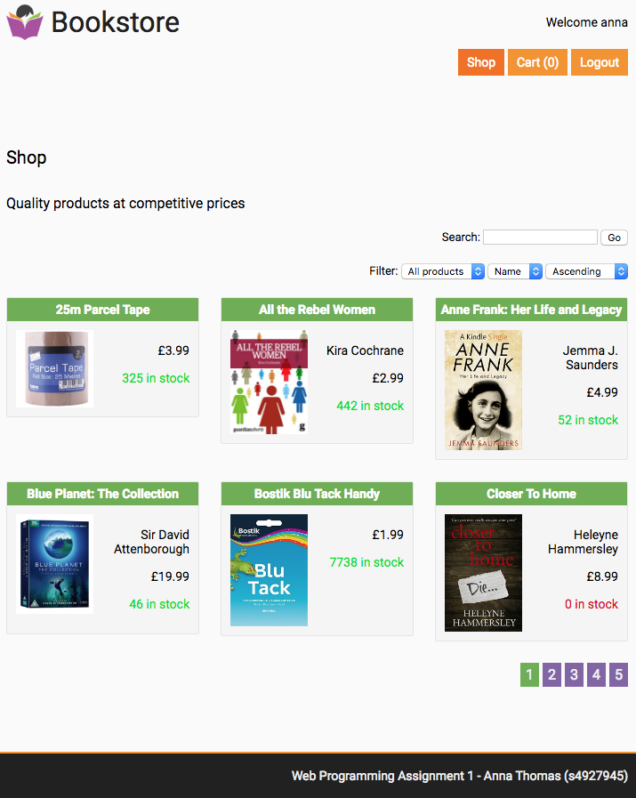
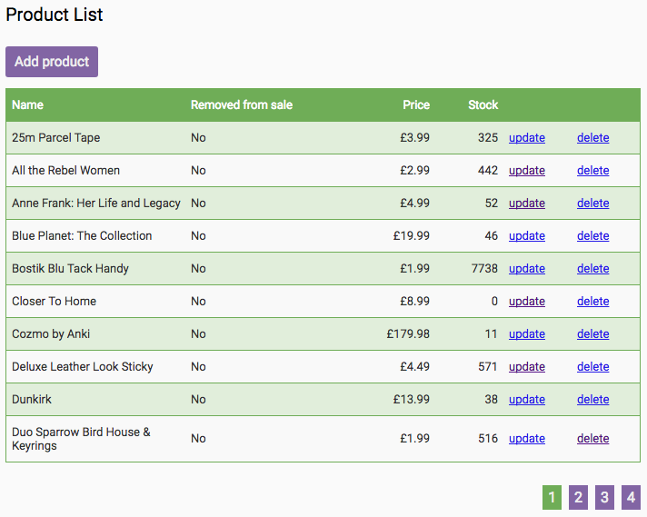

# Bookstore

Bookstore webapp that uses a bespoke MVC CMS framework I wrote for Uni. It provides registration and login account management as well as product, product category and purchase management for admins, and cart-based product purchasing for customers browsing products.  

The CMS takes some inspiration from panique's [mini3](https://github.com/panique/mini3) framework.  The bookstore uses an older version of my CMS than [my wiki webapp](https://github.com/annahowell/Wiki).

## Installation

1. Run `composer install` from the root directory 
2. Run bookstore\_mysql\_create.sql to create and populate the 'bookstore' database
3. Set your database IP, port, user and password in application/config.php
4. Point your httpd to the root folder with URL re-writes enabled

### Admin Login details

User: admin  
Pass: Password123
  
### Customer Login details

User: anna  
Pass: Password123  
(Or use the registration page to make an account)

## Screenshots

##### Customer Homepage  

  
##### Admin Product List Page  

